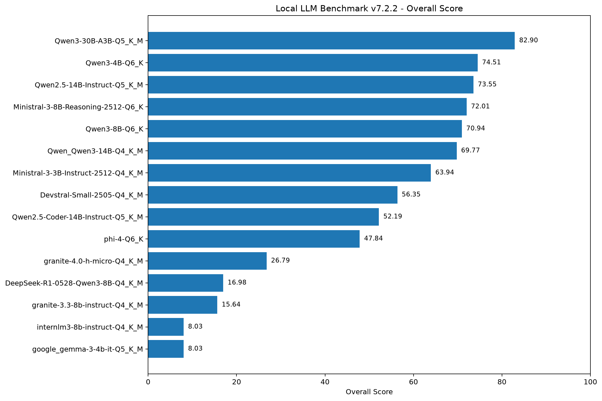
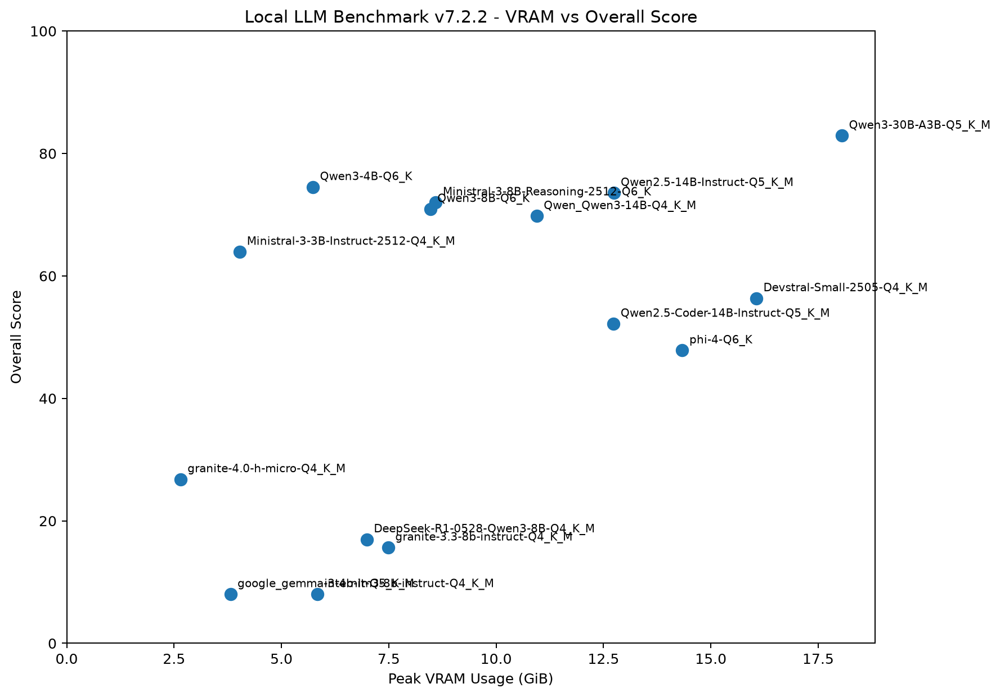
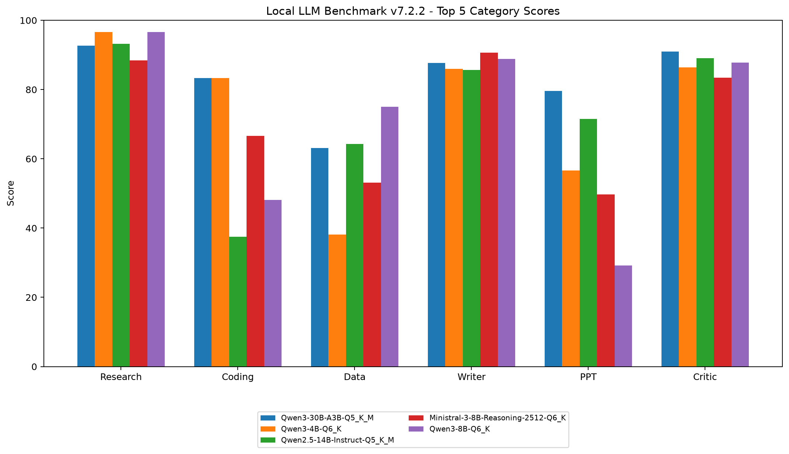

# Local LLM Multi-Agent Benchmark

A practical benchmark for evaluating local open-weight language models on real work-oriented tasks.

Instead of evaluating models only with short question-answer tests, this project measures whether a model can successfully produce usable outputs such as:

- Python code
- data analysis results
- reports
- PowerPoint presentations
- research briefs
- critiques and reviews
- structured files and artifacts

The benchmark was executed locally using GGUF models through LM Studio.

---

## What Is Evaluated?

The benchmark evaluates the following capabilities:

- Research
- Coding
- Data Analysis
- Writing
- PowerPoint Generation
- Critic / Review
- Instruction Following
- Tool Calling

Generated artifacts and model transcripts are preserved in the repository so that scores can be inspected against the actual model outputs.

---

## Test Environment

- CPU: AMD Ryzen 9 9950X
- GPU: NVIDIA GeForce RTX 3090 24 GB
- RAM: 64 GB DDR5
- Storage: Samsung 990 PRO 4 TB NVMe SSD
- Motherboard: ASRock X870E Taichi
- Operating System: Windows 11
- Inference Runtime: LM Studio
- Model Format: GGUF
- Python: 3.11

The benchmark results in this repository were produced using a single functional RTX 3090 unless otherwise noted.

More information:

[Hardware & Environment](docs/hardware.md)

---

## Benchmark Versions

This repository contains two benchmark methodologies.

### Version 1

The original benchmark implementation.

It evaluates multiple practical task categories and records:

- category scores
- overall score
- generation speed
- model responses
- generated artifacts

Results:

`results/v1/`

### Version 7.2.2

A stricter artifact-oriented benchmark methodology.

Version 7.2.2 introduces:

- artifact validation
- automated coding tests
- stricter task completion requirements
- zero scores for missing or invalid outputs where applicable
- execution status tracking
- deterministic checks for generated files
- PowerPoint artifact validation

Results:

`results/v7_2_2/`

> **Important**
>
> Scores from Version 1 and Version 7.2.2 are not directly comparable because the evaluation and scoring methodologies are different.

See:

[Benchmark Version Differences](docs/benchmark_versions.md)

---

## Version 7.2.2 Leaderboard

| Rank | Model | Overall | Research | Coding | Data | Writer | PPT | Critic | Peak VRAM |
|---:|---|---:|---:|---:|---:|---:|---:|---:|---:|
| 1 | Qwen3-30B-A3B-Q5_K_M | 82.90 | 92.72 | 83.33 | 63.10 | 87.71 | 79.59 | 90.95 | 18.05 GiB |
| 2 | Qwen3-4B-Q6_K | 74.51 | 96.62 | 83.33 | 38.10 | 86.00 | 56.61 | 86.41 | 5.73 GiB |
| 3 | Qwen2.5-14B-Instruct-Q5_K_M | 73.55 | 93.18 | 37.50 | 64.30 | 85.71 | 71.52 | 89.07 | 12.74 GiB |
| 4 | Ministral-3-8B-Reasoning-2512-Q6_K | 72.01 | 88.42 | 66.67 | 53.10 | 90.66 | 49.76 | 83.47 | 8.60 GiB |
| 5 | Qwen3-8B-Q6_K | 70.94 | 96.62 | 48.17 | 75.00 | 88.83 | 29.20 | 87.79 | 8.47 GiB |
| 6 | Qwen3-14B-Q4_K_M | 69.77 | 98.83 | 66.67 | 50.00 | 90.66 | 28.83 | 83.62 | 10.95 GiB |
| 7 | Ministral-3-3B-Instruct-2512-Q4_K_M | 63.94 | 88.06 | 50.47 | 8.33 | 82.92 | 69.68 | 84.20 | 4.03 GiB |
| 8 | Devstral-Small-2505-Q4_K_M | 56.35 | 94.35 | 83.33 | 0.00 | 55.71 | 16.11 | 88.62 | 16.06 GiB |
| 9 | Qwen2.5-Coder-14B-Instruct-Q5_K_M | 52.18 | 72.23 | 33.33 | 26.67 | 26.50 | 75.39 | 79.00 | 12.74 GiB |
| 10 | Phi-4-Q6_K | 47.84 | 90.61 | 48.17 | 0.00 | 89.96 | 0.00 | 58.29 | 14.34 GiB |
| 11 | Granite-4.0-H-Micro-Q4_K_M | 26.79 | 40.95 | 16.67 | 0.00 | 50.62 | 12.13 | 40.38 | 2.65 GiB |
| 12 | DeepSeek-R1-0528-Qwen3-8B-Q4_K_M | 16.98 | 0.00 | 48.17 | 0.00 | 53.71 | 0.00 | 0.00 | 6.99 GiB |
| 13 | Granite-3.3-8B-Instruct-Q4_K_M | 15.64 | 0.00 | 75.93 | 0.00 | 17.92 | 0.00 | 0.00 | 7.49 GiB |
| 14 | InternLM3-8B-Instruct-Q4_K_M | 8.03 | 0.00 | 48.17 | 0.00 | 0.00 | 0.00 | 0.00 | 5.83 GiB |
| 15 | Gemma-3-4B-IT-Q5_K_M | 8.03 | 0.00 | 48.17 | 0.00 | 0.00 | 0.00 | 0.00 | 3.81 GiB |

The highest overall score in Version 7.2.2 was achieved by **Qwen3-30B-A3B-Q5_K_M**, with an overall score of **82.90**.

---

## Benchmark Visualizations

The following charts are generated directly from:

`results/v7_2_2/model_scores.csv`

The chart generation script is available at:

`scripts/generate_charts.py`

### Overall Benchmark Score

This chart compares the overall Version 7.2.2 benchmark score across all evaluated models.



### VRAM vs Overall Score

This chart compares peak VRAM usage with overall benchmark performance.

It can be used to inspect the trade-off between local GPU memory requirements and practical task performance.



### Top 5 Models by Task Category

This chart compares the five highest-ranked models across:

- Research
- Coding
- Data
- Writer
- PPT
- Critic



---

## Inspect the Actual Model Outputs

Benchmark scores are not the only results preserved in this repository.

Version 7.2.2 stores the actual files produced during each model run under:

`runs/<model-name>/<task-id>/`

For example:

```text
runs/Qwen3-30B-A3B-Q5_K_M/
├── C01/    # Coding
├── C02/
├── C03/
├── D01/    # Data Analysis
├── D02/
├── D03/
├── K01/    # Critic / Review
├── K02/
├── K03/
├── P01/    # PowerPoint
├── P02/
├── P03/
├── R01/    # Research
├── R02/
├── R03/
├── W01/    # Writing
├── W02/
└── W03/
```

Depending on the task, these directories may contain:

- `_transcript.json`
- generated Python code
- pytest tests
- Markdown reports
- CSV files
- JSON analysis
- charts
- Excel workbooks
- PowerPoint presentations
- research briefs
- review documents

This makes it possible to inspect not only the final benchmark score, but also the actual work produced by each model.

---

## Reproducing the Charts

The visualizations in this README are generated from the Version 7.2.2 result CSV.

Run:

```powershell
python .\scripts\generate_charts.py
```

The generated images are stored in:

```text
docs/images/
├── overall_scores.png
├── vram_vs_score.png
└── category_scores.png
```

This allows the charts to be regenerated automatically when new benchmark results are added.

---

## Repository Structure

```text
llm-benchmark/
├── README.md
├── LICENSE
├── .gitignore
│
├── benchmark_v1/
│   ├── benchmark.py
│   ├── config.json
│   ├── tasks.json
│   └── ...
│
├── benchmark_v7_2_2/
│   ├── benchmark_v7_2_2.py
│   ├── config.json
│   ├── tasks.json
│   ├── selected_models.json
│   └── ...
│
├── docs/
│   ├── methodology.md
│   ├── hardware.md
│   ├── benchmark_versions.md
│   ├── models.md
│   └── images/
│       ├── overall_scores.png
│       ├── vram_vs_score.png
│       └── category_scores.png
│
├── scripts/
│   └── generate_charts.py
│
├── results/
│   ├── v1/
│   └── v7_2_2/
│
└── runs/
    └── Actual model-generated artifacts
```

---

## Documentation

- [Benchmark Methodology](docs/methodology.md)
- [Hardware & Environment](docs/hardware.md)
- [Benchmark Version Differences](docs/benchmark_versions.md)
- [Evaluated Models](docs/models.md)

---

## Notes

Benchmark results are specific to the tested:

- model
- quantization
- benchmark version
- inference configuration
- hardware environment

Results should not automatically be generalized to different quantizations or runtime configurations.

Performance measurements such as latency and VRAM usage may also vary across systems.

For meaningful comparisons, models should be compared within the same benchmark version and under equivalent test conditions.

---

## Project Goal

The long-term goal of this project is to evaluate which local language models are most suitable for practical multi-agent AI systems.

Rather than selecting models based only on conventional benchmark scores, the project focuses on their ability to perform real tasks such as research, coding, data analysis, document generation, presentation creation, and output review.